# **The Hangman Game**

A classic game of hangman written in Python and played in a terminal based window. The game is deployed to Code Institute's mock terminal on Heroku.   

User will only have six attempts to try and uncover the letters of the secret word - the only hint is the length of the word. The words is randomly selected from a file  
with nearly 2500 words. The letters of the secret word is hidden by asterisk symbols and will uncover one by one as the user guesses the correct letter. The secret word  
is revealed to user at the end of the game regardless of forfeit or win. If user manages to guess the word, 100 point is awarded and a total score is shown before the user  
exits the game.
  
[Here is the live version of my project](https://hangman-gamee.herokuapp.com/)

---
## **How to play** 

 * Hangman is a guessing game were the user's mission is to guess all letter in a secret word with a maxiumum times of attempts.
 * In this game the secret word is shown on the screen hidden by asterisk symbols so the only hint user's gets is the length of the word.
 * User will have a total of 6 attempts on each word, for every inaccurate guess the attempts reduces by 1. 
 * Invalid characters such as symbols, double letters, numbers or already used letters will not affect user's remaining attempts.
 * User is awarded 100 points every time they manage to guess a word.
 * At the end of the game user's can choose to restart or end game, if they choose to end the game a total score is shown otherwise the  
 game will restart and the score will continue count as the game proceeds.
 * To read more about the traditional game of hangman, you can visit [this wikipedia page](https://en.wikipedia.org/wiki/Hangman_(game)).

 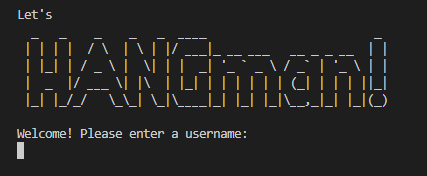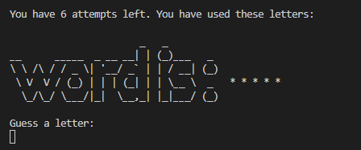

 ---

## **Features**

### **Main game page**

* User's is greeted by a big pattern saying "Let's HANGman!" with a welcome message instructing them to input a username.
* The instructions for the game appears in the terminal after the user has choosen a username.
* The game will start as soon as the user presses the enter key.  

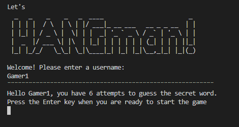

### **The secret word**
* The secret word is randomly generated from a list of nearly 2500 words.
* The letters in the word is hidden by asterisk symbols and will only uncover if user inputs a correct letter.
* The attempts counter will reduce by one everytime the user passes a letter that is not in the secret word.

### **Attempts**

* User is granted 6 attempts to every word and game.
* Attempts reduces by one each time the user passes a letter that is not in the word.
* The attempts counter will ignore blunders such as already used letters, symbols, numbers or double letters.  
  
  
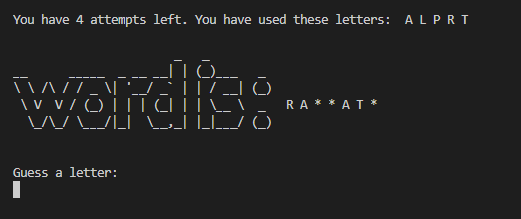

### **Input validation of letters**

* Used letters is stored and visual to the user at the top of the right corner.
* If user passes the same letter twice, invalid characters, or a letter that is not in the word an  
message appears at the top of the page to give the user feedback.  

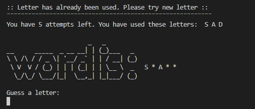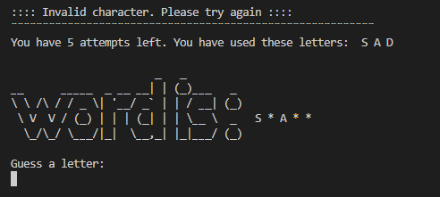  
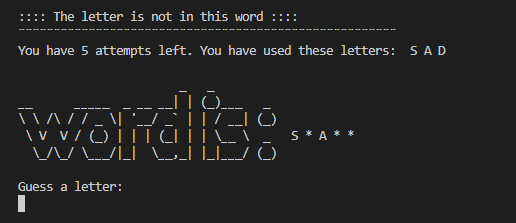

### **If user wins**

* If the user can guess all letters in the word, the terminal clears and a congratulations message appears in the window.
* 100 points is added to users score.
* User get the option to restart game or end game.

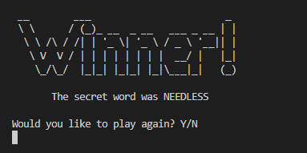

### **If user runs out of attempts**

* If user runs out of attempts the terminal clears and a message appears like down below
* User gets the option to restart or to end game.

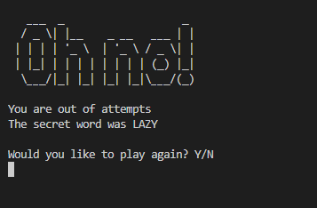

### **Scores**

* User can only win points by guessing the secret word before attempts run out
* User earns 100 points for every time they manage to guess the word 
* User can never loose points
* Total score is shown when user enters "n" and descides to end game

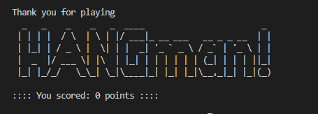

---

## **Testing**

I have manually tested this project by doing the following:

* I tested and found no errors in the gitpod terminal after installing pycodestyle due to PEP8 website being down.
* I tested that the inputs only allows expected characters and trows error when unexpected characters is used.
* Remining is 55 warnings due to the pattern writing im using for the main- and other logos and 3 warnings that followed  
with the Code Institute template that we students were instructed to ignore.  

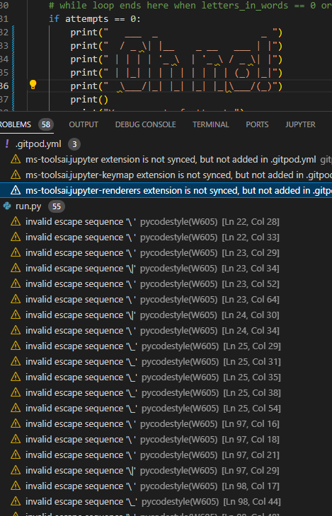

## **Bugs**

### **Solved Bugs**

* When following the love sandwich project deployment, tutor mentions that modules imported for code needs to be installed  
and moved to requirements file in order for them to work in Heroku. I tried importing my modules but got error messages for  
all of them. Went through slack and google in search for a solution. At last i contacted my mentor who explained to me   
that the modules I'm using for my project is standard python and does'nt need installment. 

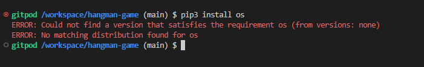

### **Remaining Bugs**

* Can't seem to shake off the 55 warnings due to the pattern writing. Would off looked better if they were'nt there.  
But the pattern writing makes the game a bit more fun!

---

## **Deployment**

The site was deployed to GitHub pages. The steps to deploy are as follows:
* In the GitHub repository, navigate to the settings tab.
* From the source section drop-down menu, select the Master Branch.
* Once the master branch has been selected, the page provided the link to the completed website.

The live link can be found here - [The Yoga Studio](https://thereslundqvist.github.io/The-Yoga-Studio/)

---

## **Credits**

### **Content**

* The text for the about section is copied and translated from [Hot Yoga - Stockholm](https://www.hotyogasthlm.se/)
* The customer reviews was copied from [Trustpilot](https://www.trustpilot.com/review/www.yogabody.com)
* Icons for about, reviews, social media icons and blog headers are from [Font Awesome](https://fontawesome.com/)
* The blogposts are copied from [Mind Oasis](https://mindoasis.org/)

### **Media** 

* The images was all downloaded from [Pexels](https://www.pexels.com/sv-se/)
