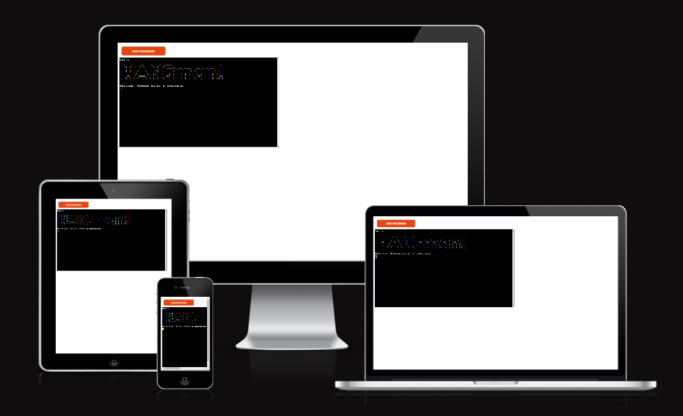

# **The Hangman Game**

A classic game of hangman written in Python and played in a terminal-based window. The game is deployed to Code   
Institute's mock terminal on Heroku. 

The user will only have six attempts to try and uncover the letters of the secret word - the only hint is the length  
of the word. The words is randomly selected from a file with nearly 2500 words. The secret word's letters are hidden  
by asterisk symbols and will uncover one by one as the user guesses the correct letter. The secret word is revealed  
to the user at the end of the game regardless of forfeit or win. If the user can guess the word, 100 points are awarded  
and a total score is shown before the user exits the game.
  
[Here is the live version of my project](https://hangman-gamee.herokuapp.com/)

---
## **How to play** 

 * Hangman is a guessing game where the user's mission is to guess all letters in a secret word with a maximum  
 times of attempts.
 * In this game the secret word is shown on the screen hidden by asterisk symbols so the only hint user gets is  
 the length of the word.
 * User will have a total of 6 attempts on each word, for every inaccurate guess the attempts reduce by 1. 
 * Invalid characters such as symbols, double letters, numbers or already-used letters will not affect the user's  
 remaining attempts.
 * The user is awarded 100 points every time they manage to guess a word.
 * At the end of the game user's can choose to restart or end the game, if they choose to end the game a total  
 score is shown otherwise the game will restart and the score will continue to count as the game proceeds.
 * To read more about the traditional game of hangman, you can visit [this wikipedia page](https://en.wikipedia.org/wiki/Hangman_(game)).

 

 ---

## **Features**

### **Main game page**

* The user is greeted by a big pattern saying "Let's HANGman!" with a welcome message instructing them to input  
a username.
* The instructions for the game appear in the terminal after the user has chosen a username.
* The game will start as soon as the user presses the enter key.  

### **The secret word**
* The secret word is randomly generated from a list of nearly 2500 words.
* The letters in the word are hidden by asterisk symbols and will only uncover if the user inputs a correct letter.
* The attempts counter will reduce by one every time the user passes a letter that is not in the secret word.

### **Attempts**

* Users are granted 6 attempts to every word and game.
* Attempts is reduced by one each time the user passes a letter that is not in the word.
* The attempts counter will ignore blunders such as already-used letters, symbols, numbers or double letters.  
  
  

### **Input validation of letters**

* Used letters are stored and visual to the user at the top of the right corner.
* If the user passes the same letter twice, invalid characters, or a letter that is not in the word a  
message appears at the top of the page to give the user feedback.  

  

### **If user wins**

* If the user can guess all letters in the word, the terminal clears and a congratulations message appear in the  
window.
* 100 points is added to the users score.
* The user gets the option to restart game or end game.

### **If user runs out of attempts**

* If the user runs out of attempts the terminal clears and a message appears like down below
* User gets the option to restart or to end the game.

### **Scores**

* The user can only win points by guessing the secret word before attempts run out.
* The user earns 100 points for every time they manage to guess the word. 
* Users can never lose points.
* Total score is shown when the user enters "n" and descide to end game.

---

## **Testing**

I have manually tested this project by doing the following:

* I tested and found no errors in the gitpod terminal after installing pycodestyle due to PEP8 website being down.
* I tested that the inputs only allows expected characters and throws error when unexpected characters arr used.
* Remaining is 55 warnings due to the pattern writing I'm using for the main- and other logos and 3 warnings that  
followed with the Code Institute template that we students were instructed to ignore.  

## **Bugs**

### **Solved Bugs**

* When following the love sandwich project deployment, the tutor mentioned that modules imported for the code  
needs to be installed and moved to the requirements file for them to work in Heroku. I tried importing my  
modules but got error messages for all of them. Went through slack and google in search of a solution. At last,  
I contacted my mentor who explained to me that the modules I'm using for my project are standard python and   
doesn't need installment. 

### **Remaining Bugs**

* I can't seem to shake off the 55 warnings due to the pattern writing. Would have looked better if they weren't  
there. But the pattern writing makes the game a bit more fun!

---

## **Deployment**

Code Institute has provided a [template](https://github.com/Code-Institute-Org/python-essentials-template) to display the terminal view of this backend application in a modern web  
browser. This is to improve the accessibility of the project to others.

The live deployed application can be found at [here](https://hangman-gamee.herokuapp.com/).

### **Local Deployment**

*Gitpod* IDE was used to write the code for this project.

To make a local copy of this repository, you can clone the project by typing the follow into your IDE terminal:
- `git clone https://github.com/TheresLundqvist/hangman-game.git`

Alternatively, if using Gitpod, you can click below to create your own workspace using this repository.

### **Heroku Deployment**

This project uses [Heroku](https://www.heroku.com), a platform as a service (PaaS) that enables developers to build, run, and operate  
applications entirely in the cloud. This project also uses Code Institute's mock terminal for Heroku.

Deployment steps are as follows, after account setup:

- Select *New* in the top-right corner of your Heroku Dashboard, and select *Create new app* from the dropdown menu.
- Your app name must be unique, and then choose a region closest to you (EU or USA), and finally, select *Create App*.
- From the new app *Settings*, click *Reveal Config Vars*, and set the value of KEY to `PORT`, and the value to `8000` then select  
*add*.
- Further down, to support dependencies, select *Add Buildpack*.
- The order of the buildpacks is important, select `Python` first, then `Node.js` second.  
(if they are not in this order, you can drag them to rearrange them)

## **Credits**

* Big thank you to my mentor for always guiding me and answering when I'm suffering meltdown's with the code! 
* Code Institute for the template for this project.
* [Youtube](https://www.youtube.com/) for great tutorials and inspiration.
* [ASCII ART](http://patorjk.com/software/taag/#p=display&f=Graffiti&t=Type%20Something%20) for the pattern logos used for this project.
* [Wikipedia](https://en.wikipedia.org/wiki/Hangman_(game)) for the details on the hangman game.
